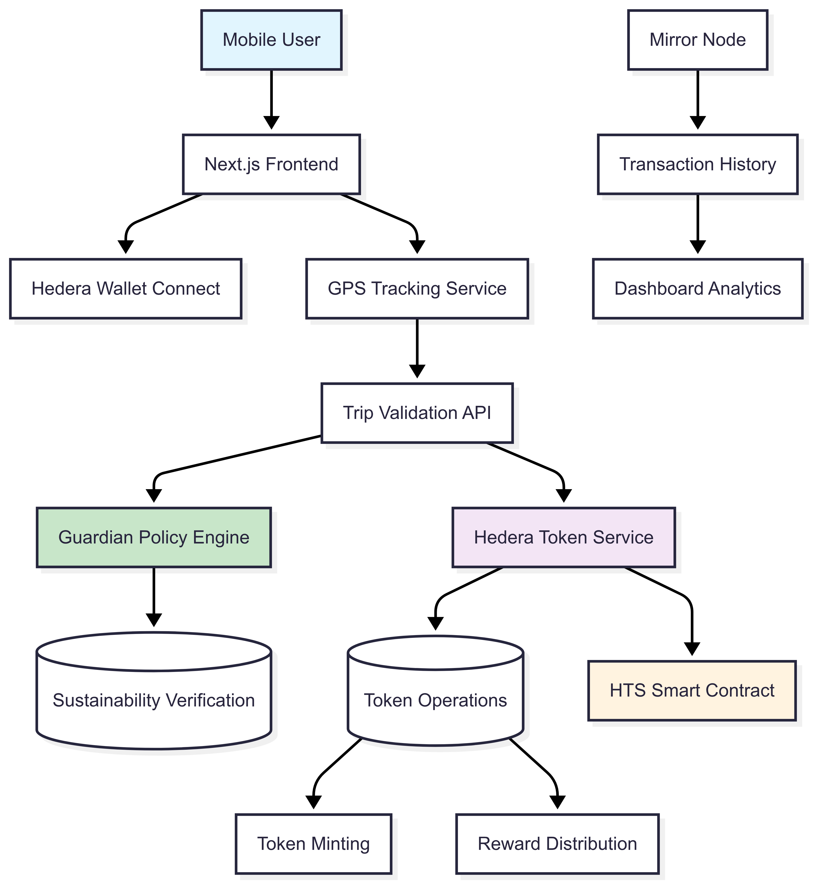
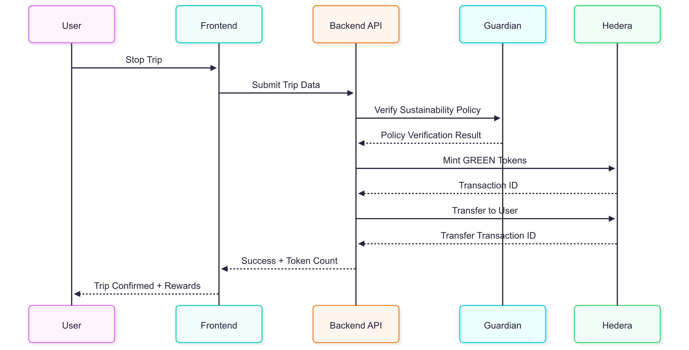

# GreenHop - Sustainable Travel Rewards Platform

> **Empowering sustainable last-mile transportation through blockchain-verified incentives**

GreenHop is a platform that transforms everyday walking and cycling into tangible rewards. Built on the Hedera network with Guardian policy integration, we create a transparent, gamified ecosystem where users earn GREEN tokens for choosing sustainable transportation methods over carbon-intensive alternatives.

[](https://hedera.com)

---
> **🏆 Built on Experience**: This project builds upon our previous Hedera hackathon works with [MetroGreen](https://github.com/lakshyashishir/MetroGreen) and [CarboCredit](https://github.com/lakshyashishir/CarboCredit), combining insights from public transit rewards and carbon credit systems to create the ultimate sustainable transportation platform.
---

## The Problem We're Solving

### Urban Mobility Crisis
- **30% of urban trips** are under 5km - perfect for active transportation
- **Last-mile transportation** accounts for 25% of urban CO₂ emissions
- **Behavioral change** requires tangible incentives beyond environmental awareness
- **Verification challenges** prevent effective reward distribution for sustainable choices

### Current Market Gaps
- Existing platforms lack real-time verification
- No integration between environmental impact and tokenized rewards
- Limited transparency in sustainability metrics
- Fragmented ecosystem with no unified reward mechanism

---

## Our Solution

GreenHop creates a comprehensive ecosystem that:

1. **Verifies sustainable trips** using GPS tracking and Guardian policies
2. **Quantifies environmental impact** through standardized CO₂ calculations
3. **Rewards users instantly** with GREEN tokens via Hedera Token Service (HTS)
4. **Creates network effects** through community challenges and leaderboards
5. **Enables ecosystem participation** through token utility and partnerships

### Key Innovation: Triple Verification System
- GPS Verification: Real-time location tracking prevents fraud
- Guardian Policies: Smart contract-based sustainability validation
- Behavioral Analytics: Machine learning models detect authentic travel patterns

---

## Technical Architecture



*System Architecture Overview showing the complete data flow from user interaction to token rewards*

### System Components

#### **Frontend Layer** (`apps/web/`)
- **Framework**: Next.js 14 with TypeScript
- **Wallet Integration**: HashPack, Kabilan, Metamask Snaps
- **Real-time Tracking**: Geolocation API with 5-second intervals
- **State Management**: React Context with persistence
- **UI Framework**: Tailwind CSS + shadcn/ui components

#### **Backend API** (`apps/api/`)
- **Runtime**: Node.js with Fastify framework
- **Architecture**: Microservices with service layer pattern
- **Authentication**: Wallet signature verification
- **Rate Limiting**: Per-user trip submission controls
- **Data Persistence**: In-memory with planned database integration

#### **Blockchain Layer**
- **Network**: Hedera Hashgraph (Testnet/Mainnet)
- **Token Standard**: Hedera Token Service (HTS)
- **Smart Contracts**: TypeScript-based Hedera SDK integration
- **Consensus**: Hashgraph consensus for instant finality

#### **Verification Engine**
- **Guardian Integration**: Policy-based sustainability verification
- **GPS Validation**: Multi-point coordinate verification
- **Speed Analysis**: Real-time speed monitoring (max 15 km/h)
- **Distance Calculation**: Haversine formula for accurate measurements

---

## API Documentation

### Base URL: `http://localhost:3001/api`

#### Trip Management Endpoints

##### `POST /trips/submit`
Submit a completed trip for verification and reward processing.

**Request Body:**
```json
{
  "userAccountId": "0.0.123456",
  "startTime": 1640995200000,
  "endTime": 1640996100000,
  "distance": 1500,
  "avgSpeed": 5.2,
  "coordinates": [
    {"lat": 40.7128, "lng": -74.0060, "timestamp": 1640995200000},
    {"lat": 40.7130, "lng": -74.0058, "timestamp": 1640995205000}
  ],
  "tripType": "walking"
}
```

**Response (Success):**
```json
{
  "success": true,
  "tripId": "trip-1640995200000-abc123def",
  "tokensEarned": 2,
  "txId": "0.0.123-1640995200-987654321",
  "vcId": "vc-guardian-xyz789",
  "message": "Successfully rewarded 2 GREEN tokens for walking trip"
}
```

**Validation Rules:**
- Minimum duration: 5 minutes
- Maximum speed: 15 km/h
- Minimum distance: 500 meters
- Minimum coordinates: 2 GPS points

##### `GET /trips/user/:accountId`
Retrieve trip history and statistics for a specific user.

**Response:**
```json
{
  "totalTrips": 15,
  "totalDistance": 22500,
  "totalTokensEarned": 28,
  "co2Saved": 2700,
  "trips": [
    {
      "id": "trip-1640995200000-abc123def",
      "tripType": "walking",
      "distance": 1500,
      "duration": 18,
      "avgSpeed": 5.2,
      "tokensEarned": 2,
      "status": "completed",
      "timestamp": 1640996100000,
      "txId": "0.0.123-1640995200-987654321",
      "vcId": "vc-guardian-xyz789"
    }
  ]
}
```

##### `GET /trips/:tripId`
Get detailed information about a specific trip.

##### `GET /trips/stats/global`
Retrieve platform-wide statistics.

**Response:**
```json
{
  "totalTrips": 1247,
  "totalDistance": 1854300,
  "totalTokensIssued": 2156,
  "totalCo2Saved": 222516,
  "avgTripDistance": 1487,
  "tripTypeBreakdown": {
    "walking": 823,
    "cycling": 424
  }
}
```

#### Token Management Endpoints

##### `GET /token/info`
Get information about the GREEN token.

**Response:**
```json
{
  "tokenId": "0.0.789456",
  "name": "GreenHop Sustainability Token",
  "symbol": "GREEN",
  "decimals": 0,
  "description": "Rewards for sustainable last-mile travel",
  "network": "testnet"
}
```

##### `GET /token/balance/:accountId`
Get token balance for a specific account.

##### `GET /token/transactions/:accountId`
Get transaction history for a specific account.

##### `POST /token/mint` (Admin Only)
Mint new GREEN tokens to the treasury.

##### `POST /token/transfer` (Admin Only)
Transfer tokens from treasury to user accounts.

---

## How It Works

### User Journey

1. **Connect Wallet**
   - Support for HashPack, Kabilan, and other Hedera wallets
   - One-click authentication via WalletConnect protocol
   - Automatic token association for first-time users

2. **Start Trip Tracking**
   - Choose trip type: Walking or Cycling
   - GPS tracking begins with 5-second coordinate collection
   - Real-time display of distance, speed, and duration

3. **Complete Sustainable Journey**
   - Minimum 500m distance to prevent gaming
   - Speed limits ensure human-powered transportation
   - Automatic trip completion when stopped for >2 minutes

4. **Earn GREEN Tokens**
   - Instant verification through Guardian policies
   - Token minting and transfer via Hedera Token Service
   - Rewards: 1 GREEN per km walked, 1.5 GREEN per km cycled

### Verification Process



*Complete verification flow from trip submission to token rewards*

---

## Business Model

### Revenue Streams

1. **Corporate Partnerships (Primary)**
   - Companies purchase GREEN tokens for employee wellness programs
   - Carbon offset partnerships with businesses seeking net-zero goals
   - Corporate challenges and team building events

2. **Municipal Partnerships (Secondary)**
   - Cities purchase GREEN tokens to incentivize sustainable transportation
   - Citizens redeem tokens for public transport discounts, parking fee reductions
   - Integration with existing city sustainability initiatives
   - Revenue sharing from reduced infrastructure costs

3. **Data Insights (Tertiary)**
   - Anonymized urban mobility pattern insights
   - Sustainability trend reports for municipalities
   - Research partnerships with academic institutions

### Token Economics

- **Total Supply**: Unlimited (inflationary)
- **Distribution**: 
  - 70% User Rewards
  - 20% Corporate Partnerships
  - 10% Platform Operations
- **Utility**:
  - Redeem for sustainable transportation vouchers
  - Access to premium platform features
  - Governance voting for route recommendations
  - Partner ecosystem discounts

### Market Opportunity

- **TAM**: $12.4B (Global urban mobility market)
- **SAM**: $2.8B (Gamification in mobility)
- **SOM**: $140M (Blockchain-verified rewards segment)

---

## Development Roadmap

### Phase 1: MVP (Current)
- Core trip tracking functionality
- GPS-based verification system
- GREEN token implementation on Hedera testnet
- Basic web interface with wallet connectivity
- Guardian policy integration
- Mobile-responsive PWA

### Phase 2: Enhanced Features (Q3 2025)
- Trip analytics and carbon footprint tracking
- Social features: leaderboards and challenges
- Integration with existing fitness apps

### Phase 3: Partnerships (Q4 2025)
- Corporate dashboard for employee wellness
- Municipal partnership pilot programs
- Partnership integrations (public transport, bike sharing)
- Mainnet deployment

### Phase 4: Scale (2026)
- Multi-city expansion
- Carbon credit marketplace integration
- Advanced fraud detection
- Enterprise API development

---

## Project Structure

```
GreenHop/
├── apps/
│   ├── web/                    # Next.js Frontend Application
│   │   ├── src/
│   │   │   ├── components/     # Reusable UI components
│   │   │   ├── hooks/          # Custom React hooks
│   │   │   ├── contexts/       # React Context providers
│   │   │   ├── services/       # API and wallet services
│   │   │   └── lib/            # Utility functions
│   │   └── public/             # Static assets
│   │
│   └── api/                    # Node.js Backend API
│       ├── src/
│       │   ├── routes/         # API route handlers
│       │   ├── services/       # Business logic services
│       │   ├── contracts/      # Hedera blockchain integration
│       │   └── index.ts        # Server entry point
│       └── package.json
│
├── packages/                   # Shared packages
│   ├── contracts/              # Hedera smart contracts
│   └── guardian-config/        # Guardian policy configurations
│
├── scripts/                    # Development and deployment scripts
│   ├── create-token.ts         # GREEN token deployment
│   └── test-trip.ts            # Trip simulation for testing
│
└── docs/                       # Documentation
    ├── API.md                  # API documentation
    ├── DEPLOYMENT.md           # Deployment guides
    └── CONTRIBUTING.md         # Contribution guidelines
```

---

## Getting Started

### Prerequisites

- **Node.js**: v18.0.0 or higher
- **npm**: v8.0.0 or higher
- **Hedera Account**: Testnet account with HBAR balance
- **Modern Browser**: Chrome, Firefox, Safari, or Edge

### Environment Setup

1. **Clone the repository**
   ```bash
   git clone https://github.com/srijabal/GreenHop.git
   cd GreenHop
   ```

2. **Configure Backend Environment**
   ```bash
   cd apps/api
   cp .env.example .env
   ```
   
   Edit `.env` with your Hedera credentials:
   ```env
   HEDERA_NETWORK=testnet
   HEDERA_ACCOUNT_ID=0.0.YOUR_ACCOUNT_ID
   HEDERA_PRIVATE_KEY=YOUR_PRIVATE_KEY_HEX
   GREEN_TOKEN_ID=0.0.YOUR_TOKEN_ID
   GUARDIAN_API_URL=https://guardian.network
   PORT=3001
   ```

3. **Configure Frontend Environment**
   ```bash
   cd ../web
   cp .env.example .env.local
   ```
   
   Edit `.env.local`:
   ```env
   NEXT_PUBLIC_API_URL=http://localhost:3001/api
   NEXT_PUBLIC_HEDERA_NETWORK=testnet
   ```

### Installation & Development

1. **Install Backend Dependencies**
   ```bash
   cd apps/api
   npm install
   npm run dev
   ```
   Backend will be available at `http://localhost:3001`

2. **Install Frontend Dependencies**
   ```bash
   cd apps/web
   npm install
   npm run dev
   ```
   Frontend will be available at `http://localhost:3000`

3. **Create GREEN Token (First Time Only)**
   ```bash
   cd scripts
   npx ts-node create-token.ts
   ```

### Testing the Platform

1. **Connect a Hedera wallet** (HashPack recommended)
2. **Associate with GREEN token** (automatic on first use)
3. **Start a trip** by selecting walking or cycling
4. **Move around** for at least 500 meters
5. **Complete the trip** and claim your GREEN tokens
6. **View your dashboard** to see trip history and rewards

---

## Technology Stack

### Frontend
- Next.js 14 with TypeScript
- Tailwind CSS + shadcn/ui components
- React Context for state management
- Hedera wallet integration (HashPack, Kabilan)

### Backend
- Node.js with Fastify framework
- TypeScript
- Hedera SDK for blockchain operations
- Guardian integration for policy verification

### Blockchain
- Hedera Hashgraph (Testnet/Mainnet)
- Hedera Token Service (HTS)
- Guardian policy framework
---

## Acknowledgments

- **Hedera Team** for the sustainable blockchain infrastructure

---

**Ready to make your daily commute count towards a greener planet? Join GreenHop today and start earning rewards for sustainable travel choices!**